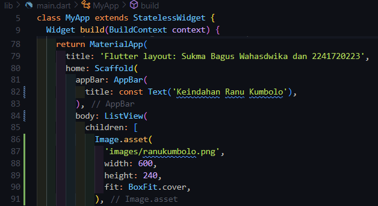

# **Layout Flutter**

#### Sukma Bagus Wahasdwika
#### 2241720223

## **Praktikum 1: Membangun Layout di Flutter**

**Langkah 1: Buat Project Baru**

Buatlah sebuah project flutter baru dengan nama layout_flutter. Atau sesuaikan style laporan praktikum yang Anda buat.

**Langkah 2: Buka file lib/main.dart**

Buka file main.dart lalu ganti dengan kode berikut. Isi nama dan NIM Anda di text title.

**Langkah 3: Identifikasi layout diagram**

Langkah pertama adalah memecah tata letak menjadi elemen dasarnya:

   * Identifikasi baris dan kolom.
   * Apakah tata letaknya menyertakan kisi-kisi (grid)?
   * Apakah ada elemen yang tumpang tindih
   * Apakah UI memerlukan tab?
   * Perhatikan area yang memerlukan alignment, padding, atau borders.
Pertama, identifikasi elemen yang lebih besar. Dalam contoh ini, empat elemen disusun menjadi sebuah kolom: sebuah gambar, dua baris, dan satu blok teks.

**Langkah 4: Implementasi tittle row**

## **Praktikum 2: Implementasi button row**

**Langkah 1: Buat method Column _buildButtonColumn**

**Langkah 2:  Buat widget buttonSection**

**Langkah 3:  Tambah button section ke body**

## **Praktikum 3: Implementasi text section**

**Langkah 1: Buat widget textSection**

**Langkah 2: Tambahkan variabel text section ke body**

## **Praktikum 4: Implementasi image section**

**Langkah 1: Siapkan aset gambar**

**Langkah 2: Tambahkan variabel text section ke body**

**Langkah 3: Terakhir, ubah menjadi ListView**

## **Tugas Praktikum 1**

1. Selesaikan Praktikum 1 sampai 4, lalu dokumentasikan dan push ke repository Anda berupa screenshot setiap hasil pekerjaan beserta penjelasannya di file README.md!

   
   
2. Silakan implementasikan di project baru "basic_layout_flutter" dengan mengakses sumber ini: https://docs.flutter.dev/codelabs/layout-basics
   https://github.com/bagusswahasdwikaa/basic_layout_flutter 
3. Kumpulkan link commit repository GitHub Anda kepada dosen yang telah disepakati!
   https://github.com/bagusswahasdwikaa/layout_flutter 

## **Praktikum 5: Membangun Navigasi di Flutter**

*Link repository Praktikum 5*: https://github.com/bagusswahasdwikaa/belanja   
